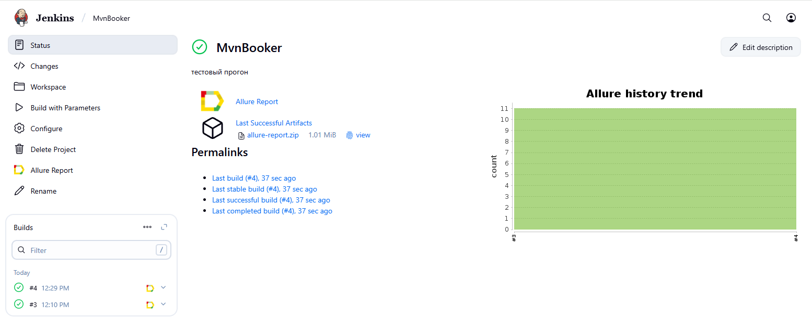
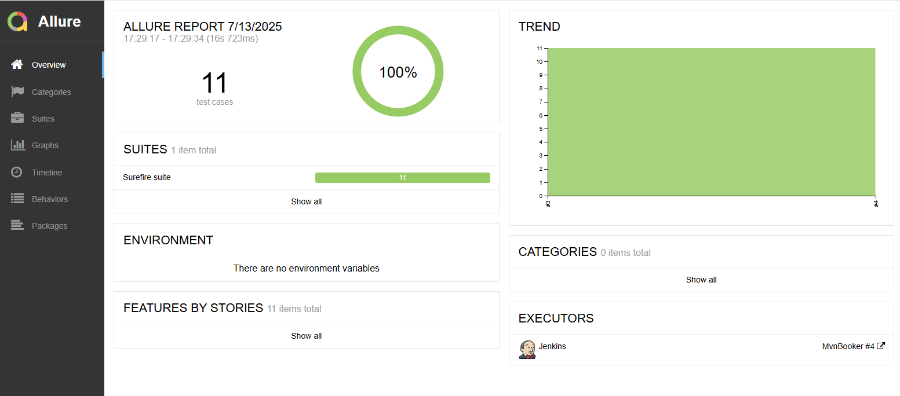
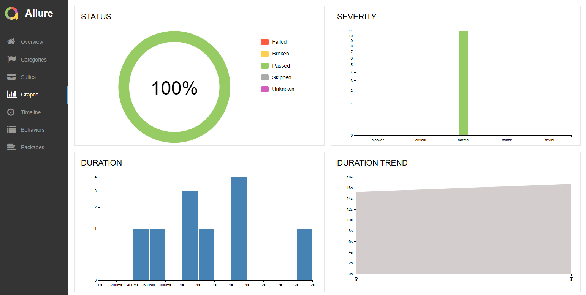
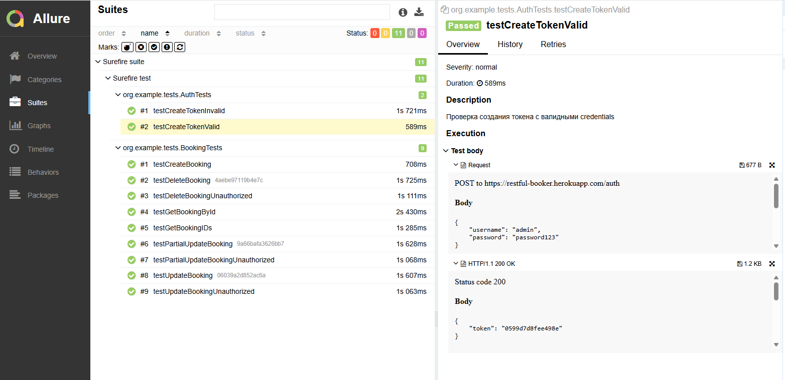
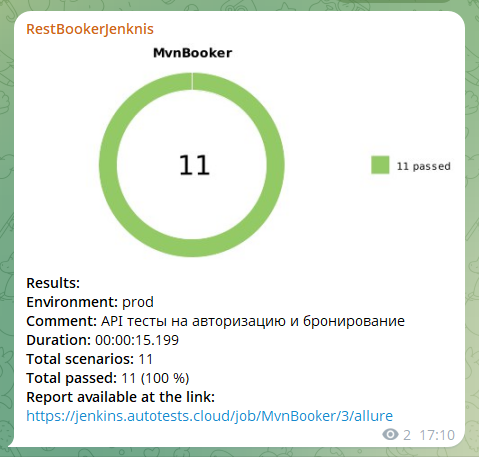

# [Restful-booker](https://restful-booker.herokuapp.com/apidoc/index.html) E2E tests for Restful-booker
</div>

##  <a name="contents">📄 Contents</a>
- [Tools and Technologies](#hammer_and_wrench-tools-and-technologies)
- [Test Cases](#white_check_mark-test-cases)
- [How to Run](#arrow_forward-how-to-run)
- [Allure Report](#-test-results-report-in-allure-report)
- [Telegram Notifications](#-telegram-notifications)

## 🛠️ Tools and Technologies
<a href="https://www.jetbrains.com/idea/"></a>
<a href="https://www.java.com"></a>
<a href="https://testng.org/"></a>
<a href="https://maven.apache.org/"></a>
<a href="https://rest-assured.io"></a>
<a href="https://www.jenkins.io"></a>
<a href="https://qameta.io/allure-report"></a>
<a href="https://web.telegram.org/"></a>

## ✅ Test Cases
- [x] Successful authorization and token retrieval with valid credentials `POST`
- [x] Authorization with invalid credentials returns "Bad credentials" `POST`
- [x] Successful creation of a new booking `POST`
- [x] Retrieval of all booking IDs returns status 200 `GET`
- [x] Retrieval of existing booking by ID `GET`
- [x] Successful update of existing booking with authorization `PUT`
- [x] Failed update without authorization token returns 403 `PUT`
- [x] Successful partial update of booking with authorization `PATCH`
- [x] Failed partial update without authorization returns 403 `PATCH`
- [x] Successful booking deletion with authorization `DELETE`
- [x] Failed booking deletion without authorization returns 403 `DELETE`


## ⚠️ Known RESTful Design Issues

📌 Known RESTful Design Issues <a name="restful-defects"></a>
<details>

<summary><strong>Click to expand list of known RESTful API inconsistencies</strong></summary>

The [Restful Booker API](https://restful-booker.herokuapp.com/apidoc/index.html) serves as a useful playground, but some endpoints deviate from REST best practices:

| # | Endpoint / Behavior              | ❌ Current Implementation                             | ✅ RESTful Expectation                          |
|----|----------------------------------|--------------------------------------------------------|-------------------------------------------------|
| 1  | `DELETE /booking/:id`           | Returns `201 Created`                                  | Should return `204 No Content` or `200 OK`      |
| 2  | `GET /ping`                     | Returns `201 Created`                                  | Should return `200 OK`                          |
| 3  | Authentication method           | Uses `Cookie: token=...`                               | Should use `Authorization: Bearer <token>`      |
| 4  | Endpoint naming style           | Verbs like `GetBooking`, `DeleteBooking`               | Use nouns/resources like `/booking/:id`         |
| 5  | API versioning                  | Not versioned (`/booking`)                             | Should use versioning like `/v1/booking`        |
| 6  | PATCH example in docs           | `curl -X PUT` used for PATCH                           | Should be `curl -X PATCH`                       |

> 🛠 These issues are expected in sandbox APIs but should be addressed in production-grade APIs to align with [RESTful principles](https://restfulapi.net/).

</details>

## 🔐 Local Configuration

To run tests locally, create a file named `local.properties` with actual 'secret' properties in the project root (the file added to .gitignore):

```properties
username=your_username
password=your_password
```

## ▶️ How to Run

### 🔹 Run Locally via Maven

Use the following commands to run specific test suites via TestNG XML:

```bash
# Run Smoke Tests (excludes defects)
mvn clean test -DsuiteXmlFile=testng-smoke.xml

# Run Regression Tests (excludes defects)
mvn clean test -DsuiteXmlFile=testng-regression.xml

# Run Known Defect Tests only
mvn clean test -DsuiteXmlFile=testng-defects.xml
```
Or run by group name (without specifying XML files):

```bash
# Run only smoke tests
mvn clean test -Dgroups=smoke

# Run only regression tests
mvn clean test -Dgroups=regression

# Run only defect/known-issue tests
mvn clean test -Dgroups=defect
```
🧩 All defect-tagged tests are excluded from smoke and regression suites to maintain clean pipelines. Run them separately if needed.

### 🔹 Run in CI/CD (Jenkins)

You can configure Jenkins or other CI systems to use these Maven commands:

```bash
# Run Smoke tests in CI
mvn clean test -DsuiteXmlFile=testng-smoke.xml

# Run Regression tests in CI
mvn clean test -DsuiteXmlFile=testng-regression.xml

# Run Defect tests in CI
mvn clean test -DsuiteXmlFile=testng-defects.xml
```
You can also pass groups as parameters if suite files aren't used:

```bash
mvn clean test -Dgroups=smoke
```
🔐 Make sure CI has access to your `local.properties` file or inject credentials via environment variables or a secure vault.



After the build, you can view the `Allure Report` results

[Back to content ⬆](#contents)

##  Test results in [Allure Report](https://jenkins.autotests.cloud/job/MvnBooker/4/allure/)
### Report Page

The page contains the following information:

>- **ALLURE REPORT** provides the number of executed tests and run time info
>- **SUITES** displays logically grouped test batches
>- **FEATURES** groups tests by feature
>- **TREND** shows test count history
>- **CATEGORIES** displays test categories



### Graph Page
This page shows various statistics based on test results: what passed and what failed.



### Test Execution Page
This page shows which tests were run in different classes, with color indicating test status, and test details.
You can also view test attachments showing request and response data.




[Back to content ⬆](#contents)

##  Telegram Notifications
 
**Telegram bot** sends results to a channel showing how many tests passed and a small chart.

<p align="center">
</p>

[Back to content ⬆](#contents)
